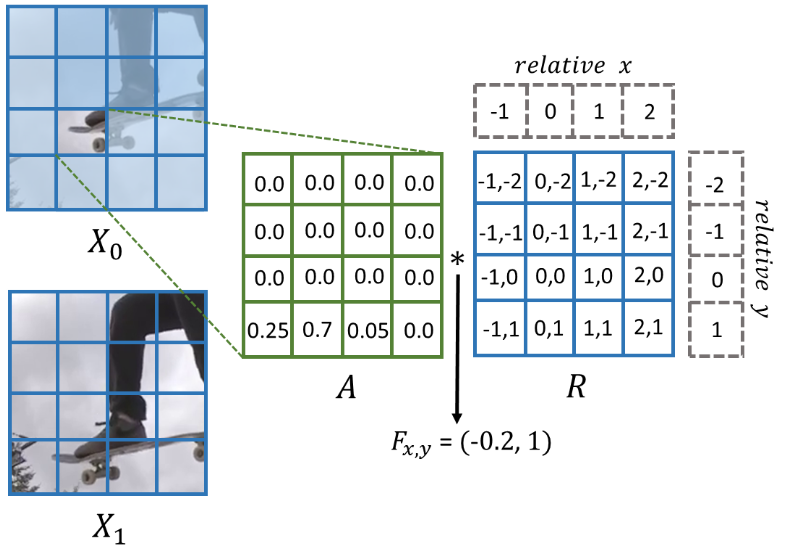

# ATM-VFI: Exploiting Attention-to-Motion via Transformer for Versatile Video Frame Interpolation (ICASSP 2025)
> 2024.12.21 -- Our paper is accepted by ICASSP2025. We have released the model checkpoints at [here](#pretrained-checkpoints).

In this work, we present a versatile VFI architecture, utilizing the Attention-to-Motion (ATM) module to intuitively formulate motion estimation.

Paper:  
- Camera-ready version (ICASSP 2025): will be released after 13 Jan 2025.
- Previous manuscript: [paper link](https://drive.google.com/file/d/1ZPuBj1yKJnqtsbdZ7OGuOwXxM4sPga_6/view?usp=sharing), [supplementary link](https://drive.google.com/file/d/1PEdZ3javboOA9v5etbkPNqJizIiTRcus/view?usp=sharing)
     
Video demo: [Youtube](https://www.youtube.com/watch?v=bSdBEfe9haM)

**Abstract —** Video Frame Interpolation (VFI) aims to synthesize realistic intermediate frames from preceding and following video frames. Although many VFI methods perform well on specific motion types, their versatility in handling both large and small motions remains limited. In this work, we propose ATM-VFI, which is a novel hybrid CNN-Transformer architecture that effectively combines the strengths of the CNN (efficiency and considering the detail information) and the transformer (well adopting the global information). It utilizes an Attention-to-Motion (ATM) module and adopts a dual-branch (local and global branches) mechanism to intuitively formulate motion estimation and estimate global and local motion adaptively. Furthermore, we introduce a four-phase training procedure leveraging small-to-medium and large motion datasets to enhance versatility and training stability. Extensive experiments demonstrate that the proposed ATM-VFI algorithm outperforms state-of-the-art methods. It can well interpolate the video frames with a variety of motion types while maintaining high efficiency.

**Experimental Results —**
- large motion:  


- small and detail motion:  


## Architecture Overview


## Attention-to-Motion
&nbsp;&nbsp;

## Dependencies
We provide the dependencies in `requirements.txt`.

## Example Usage
```python
import torch
import cv2
from network.network_base import Network # or use network.network_lite 
from demo_2x import load_model_checkpoint, inference_2frame

# initialize model
model = Network()
load_model_checkpoint(model, 'path_to_checkpoint')
device = torch.device('cuda' if torch.cuda.is_available() else 'cpu')
model.to(device).eval()

# prepare data and inference
img0 = cv2.imread("path_to_frame0")
img1 = cv2.imread("path_to_frame1")
pred = inference_2frame(img0, img1, model, isBGR=True) # please trace demo_2x.py -> inference_2frame() for details
```

## Demo Script
For 2x interpolation, run the command below:
> use `--global_off` flag to disable the global motion estimation.
- input: 2 frames
    ```
    python3 demo_2x.py --model_type <select base or lite> --ckpt <path to model checkpoint> --frame0 <path to frame 0> --frame1 <path to frame 1> --out <path to output frame>
    ```
- input: mp4 video
    ```
    python3 demo_2x.py --model_type <select base or lite> --ckpt <path to model checkpoint> --video <path to .mp4 file>
    ```
    > use `--combine_video` flag to combine the original input video and processed video.
    
### Example: 2x interpolation comparison (24 fps v.s. 48 fps)
https://github.com/user-attachments/assets/8ef55c79-6366-4b10-acd4-5299230450a3
<!---
https://github.com/user-attachments/assets/72b69fc0-3976-49b2-88b7-42c25d7b45b4
-->

## Pretrained checkpoints
Please download the model checkpoint from the google drive links.
|Version|Link|Param (M)|
|-------|----|---------|
|Base   |[GDrive](https://drive.google.com/file/d/1AVX1n5HGPK8hmuo23aLtAL46FnGf0YIU/view?usp=sharing) |51.56|
|Lite   |[GDrive](https://drive.google.com/file/d/1_WYXzeFezkJGLhx_dIVyoDUS4E6_qapM/view?usp=sharing) |11.98|
|Pct    |[GDrive](https://drive.google.com/file/d/1QiDkavHmzGfkma1QUP21hdl9Znyq7Gxy/view?usp=sharing) |51.56|

## Evalution
We evaluate our method using the `benchmark` scripts provided by [RIFE](https://github.com/hzwer/ECCV2022-RIFE/tree/main), [EMA-VFI](https://github.com/MCG-NJU/EMA-VFI/tree/main) and [AMT](https://github.com/MCG-NKU/AMT?tab=readme-ov-file) for consistency. 
- Vimeo90K
    ```
    cd benchmark
    python3 test_vimeo90k.py --path <path to Vimeo90K dataset folder> --ckpt <path to model checkpoint>
    ```
- UCF101
    ```
    cd benchmark
    python3 test_ucf101.py --path <path to UCF101 dataset folder> --ckpt <path to model checkpoint>
    ```
- SNU-FILM
    ```
    cd benchmark
    python3 test_snufilm.py --path <path to SNU-FILM dataset txt> --img_data_path <path to SNU-FILM dataset image folder> --ckpt <path to model checkpoint>
    ```
- Xiph
    ```
    cd benchmark
    python3 test_xiph.py --root <path to Xiph dataset folder> --ckpt <path to model checkpoint>
    ```

## Training/Fine-tuning
The first 2 phases of the training procedure (stated in our paper) utilize `train.py` and `trainer.py`, while the last 2 phases utilize `finetune.py` and `finetune_trainer.py`.
- Phase 1: run `train.py` and set the argument `dataset` as `vimeo90k`, the other training hyperparameters can be set as you wish (batch size, learning rate, no. of epoch, etc.). Reminder: please make sure to set `model.global_motion = False`.
- Phase 2: run `train.py`, set the argument `dataset` as `X4k`, and remember to set the variable `isLoadCheckpoint` to `True` and change `param` to the checkpoint of Phase 1. Reminder: please make sure to set `model.global_motion = True` and `model.__freeze_local_motion__()`.
- Phase 3: run `finetune.py`, change `param` to the checkpoint of Phase 2. For more tweaking, please trace the source code.
- Phase 4: run `finetune.py`, change `param` to the checkpoint of Phase 3.

## Citation
If this work is helpful for you, feel free to leave a star, or cite our paper:
```
@inproceedings{gan2025atmvfi,
    title={Exploiting Attention-to-Motion via Transformer for Versatile Video Frame Interpolation},
    author={Gan, Chee-Kim and Ding, Jian-Jiun and Hsieh, Chang-Yu and Lu, De-Yan},
    booktitle={Proceedings of the IEEE International Conference on Acoustics, Speech, and Signal Processing (ICASSP)},
    year={2025}
}

```

## Acknowledgement
Thanks to [EMA-VFI](https://github.com/MCG-NJU/EMA-VFI/tree/main), [AMT](https://github.com/MCG-NKU/AMT?tab=readme-ov-file), [RIFE](https://github.com/hzwer/ECCV2022-RIFE/tree/main), [XVFI](https://github.com/JihyongOh/XVFI), [vgg_perceptual_loss](https://gist.github.com/alper111/8233cdb0414b4cb5853f2f730ab95a49), [GMFlow](https://github.com/haofeixu/gmflow) for releasing their source code, it helped a lot in our research.